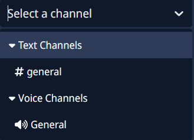

# Channel Select

Are you wondering what the "Type" section on this website means?  

If not, here is an explanation:

The "Channel-select" type means that you have to choose a channel in your server from a dropdown.  
For example, in the [AI Chat Channel module](https://howto.scnx-tutorials.de/docs/modules/ai-chat-channel) (section: AI chat channel), you have to choose a channel where users can chat with the AI Bot.  

In some modules, you may need to select a channel that is only visible to moderators and the owner, while in other cases you must choose a channel accessible to everyone.
In some cases, selecting a channel is optional, but in many cases, if you don’t choose a channel, the module will automatically disable itself.

Here is a preview on how it can look:  
