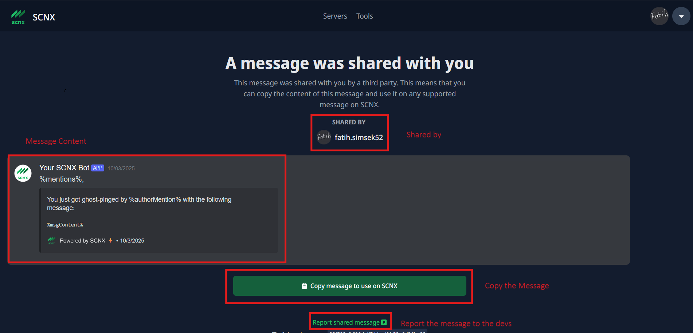
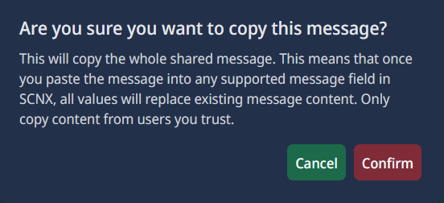
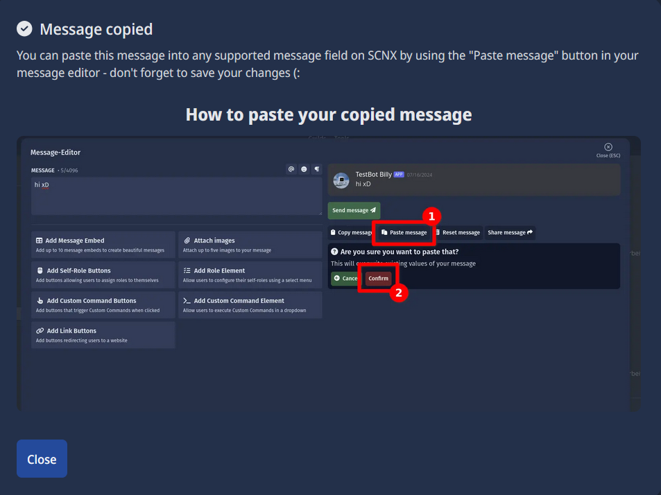

# Import a Message Guide

If you are wondering what the **import URL** is that you see on every message examples page, I’ll explain it here.  
When you click on that link, you will land on a page that shows the message content:

---

## How this page works

First, take a look at the **user who shared the message** at the top.  
The only users who can share messages are:

  

    
    Fatih.simsek52
  

  

    
    mr.t2010
  

If the users shown above **do not appear at the top**, then do **not** copy the message.  
This is because the message could be different and might have been replaced with NSFW or other inappropriate content.  
If this happens, please also report the message content to the devs using the form at the bottom of the page, in addition to reporting it in the official [How to? Discord Server](https://discord.gg/XV6jU83y5F).

---

## Copying the message

If one of the users above is displayed, you can proceed by clicking on the **"Copy message to use on SCNX"** button.  
After clicking, this pop-up will appear:

You can now decide whether you want to continue.  
If you click **Confirm**, the message content will be copied successfully. Afterwards, this window will show:

---

## Pasting the message

As the window states, you can now go to the module where you want to paste the message.  
In the message editor, simply click the **"Paste message"** button and confirm the action.

---

🎉 Done! You have successfully copied & pasted the message.  
You can repeat this process for every message example that provides a copy link.  

Such a link looks like this: https://scnx.app/import/message?key=

---

## Why should I copy the message through SCNX? I can easily copy the message on the Howto website.

Copying the message through SCNX is the recommended method. If the message contains an embed, setting it up manually can take a long time. By copying the message via SCNX, the embed is copied automatically as well. This could save you some time.