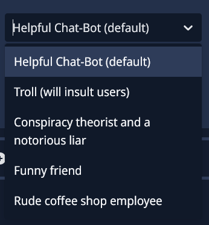

# Options

Are you wondering what the "Type" section on this website means?  

If not, here is an explanation:  

The **"Options" type** means that you have to choose an option in a dropdown menu.  
For example, in the [AI Chat Channel module](https://howto.scnx-tutorials.de/docs/modules/ai-chat-channel) (section: Personality) you have to choose between 5 options.  
If you don’t select one, SCNX will either choose the default option for you, or the module will automatically disable itself.  

In some cases, selecting an option is optional. In most cases, it is marked as **`[OPTIONAL]`** in *scnx.app*. You can find the module description there, and it will say whether it is optional or not.  

- If you see **`Required: true`**, then you must choose one.  
- If you see **`Required: false`**, then it is optional.  

Here is an example picture of how it can look:  
